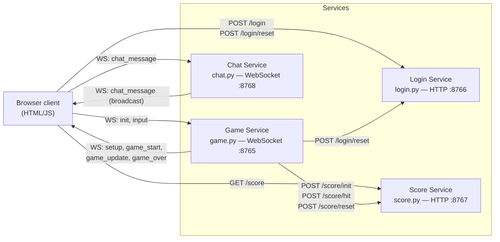

# Space Blasters

A real-time, 2-player browser spaceship shooter built on a small set of independent Python microservices. Two players fly ships around a shared arena, fire lasers at each other, and the first to land 10 hits wins.

## Architecture

The game is split into four standalone backend services plus a static HTML/JS frontend. There is no shared database or message broker — services talk directly to each other over HTTP and WebSockets, and each keeps its state in memory.



**Key point:** the **Game Service is the hub**. It's the only backend service that calls other backend services — it reports hits to the Score Service and clears the Login Service's player roster when a match ends. The Login, Score, and Chat services never talk to each other directly; they only respond to whichever client (browser or Game Service) calls them.

## Services

| Service | File | Protocol | Port | Role |
|---|---|---|---|---|
| Login | [login.py](login.py) | HTTP | `8766` | Registers screen names, issues `player_id`s, enforces the 2-player cap |
| Game | [game.py](game.py) | WebSocket | `8765` | Authoritative game loop (physics, collisions, scoring triggers) at 30 FPS |
| Score | [score.py](score.py) | HTTP | `8767` | Tracks each player's hit count |
| Chat | [chat.py](chat.py) | WebSocket | `8768` | Broadcasts chat messages between connected clients |

All services bind to `localhost` and keep state in plain in-memory dicts — restarting a service wipes its state. There is no persistence layer.

### Login Service (`login.py`, port 8766)

Plain `http.server`-based HTTP API. Maps a chosen screen name to a short `player_id` (UUID prefix) and rejects duplicates or a full lobby.

| Method | Path | Body | Response |
|---|---|---|---|
| `POST` | `/login` | `{ "screen_name": "..." }` | `200 { player_id, screen_name }`, `409` if name taken, `403` if lobby full (max 2) |
| `POST` | `/login/reset` | — | `200 { status: "ok" }` — clears all registered players |

Called by:
- **Browser** ([login.js](login.js)) on the login screen, to register and get a `player_id` before entering the game.
- **Game Service** (`game.py`), which calls `/login/reset` after a match ends so the lobby is open for a new game.

### Game Service (`game.py`, port 8765)

The authoritative real-time engine. Each browser opens a WebSocket connection and exchanges JSON messages; the server runs a fixed 30 FPS loop (`game_loop`) that updates ship positions, laser hits, and broadcasts state to both players.

**Client → Server messages:**
| Type | Payload | Purpose |
|---|---|---|
| `init` | `{ screen_name, player_id }` | Sent once on connect to join the match |
| `input` | `{ keys: { rotateLeft, rotateRight, thrust, fireLaser } }` | Sent every frame (30 FPS) with current key state |

**Server → Client messages:**
| Type | Purpose |
|---|---|
| `setup` | Initial ack after joining — ship size, screen name |
| `game_start` | Sent once the second player connects; resets positions and starts a countdown |
| `game_update` | Broadcast every tick with full player/laser state |
| `player_disconnected` | Sent to the remaining player if the opponent drops |
| `game_over` | Sent when a player reaches the win score; names the winner |
| `error` | Sent (then connection closed) if the lobby is already full |

**Outbound calls made by the Game Service itself:**
- `POST http://localhost:8767/score/init` — when a player joins, to zero their score.
- `POST http://localhost:8767/score/hit` — when a laser hit is detected; the response's score is checked against the win threshold (10) to trigger `game_over`.
- `POST http://localhost:8767/score/reset` and `POST http://localhost:8766/login/reset` — both fired when a match ends, to reset the Score and Login services for the next game.

### Score Service (`score.py`, port 8767)

Plain `http.server`-based HTTP API storing `player_id -> score` in memory.

| Method | Path | Purpose |
|---|---|---|
| `POST` | `/score/init` | Create a score entry (0) for a new player |
| `POST` | `/score/hit` | Increment a player's score by 1, returns the new total |
| `POST` | `/score/reset` | Clear all scores |
| `GET` | `/score` | Return the full `{player_id: score}` map |
| `GET` | `/score/<player_id>` | Return one player's score |

Called by:
- **Game Service**, to init/increment scores as described above.
- **Browser** ([game.js](game.js)), which polls `GET /score` once per second to render the live scoreboard.

### Chat Service (`chat.py`, port 8768)

Minimal WebSocket broadcast server — no HTTP surface, no persistence. Every connected client is kept in an in-memory set; any `chat_message` received is stamped with a server timestamp and rebroadcast to **all** connected clients (including the sender).

| Type | Direction | Payload |
|---|---|---|
| `chat_message` | Client → Server | `{ player_id, message }` |
| `chat_message` | Server → Client (broadcast) | `{ player_id, message, timestamp }` |

The Chat Service is fully decoupled from the Game/Login/Score services — it doesn't validate `player_id`s or know who's currently in a match.

## Frontend flow

Static HTML/JS served directly from the filesystem (no frontend build step):

```
index.html → instructions.html → login.html → instructions.html → game.html
```

1. **[login.html](login.html)** / **[login.js](login.js)** — collects a screen name, `POST`s it to the Login Service, and stores the returned `player_id` + `screen_name` in `sessionStorage`.
2. **[instructions.html](instructions.html)** / **[moreinfo.html](moreinfo.html)** — static controls reference.
3. **[game.html](game.html)** / **[game.js](game.js)** — the game screen. On load it:
   - fetches the current scoreboard from the Score Service (`GET /score`, then polls every second),
   - opens a WebSocket to the Game Service and sends the stored `player_id`/`screen_name` as an `init` message,
   - opens a second WebSocket to the Chat Service for the in-game chat box,
   - renders game state to a `<canvas>` at 30 FPS and streams key input back to the Game Service.

## Running locally

Requires Python 3 and the packages in [requirements.txt](requirements.txt) (`websockets`, `aiohttp`).

```bash
pip install -r requirements.txt
python start_servers.py
```

[start_servers.py](start_servers.py) launches all four services (`game.py`, `login.py`, `score.py`, `chat.py`) as subprocesses and shuts them all down cleanly on `Ctrl+C`. Then open `index.html` in a browser (in two separate tabs/windows to play both sides).

## Notes / limitations

- All state is in-memory and per-process — restarting any service resets it, and nothing survives a crash.
- Ports and hosts (`localhost:876x`) are hardcoded in both the Python services and the frontend JS, so this setup is single-machine/local only as written.
- The lobby is hardcoded to 2 players; a 3rd connection is rejected by both the Login and Game services.
